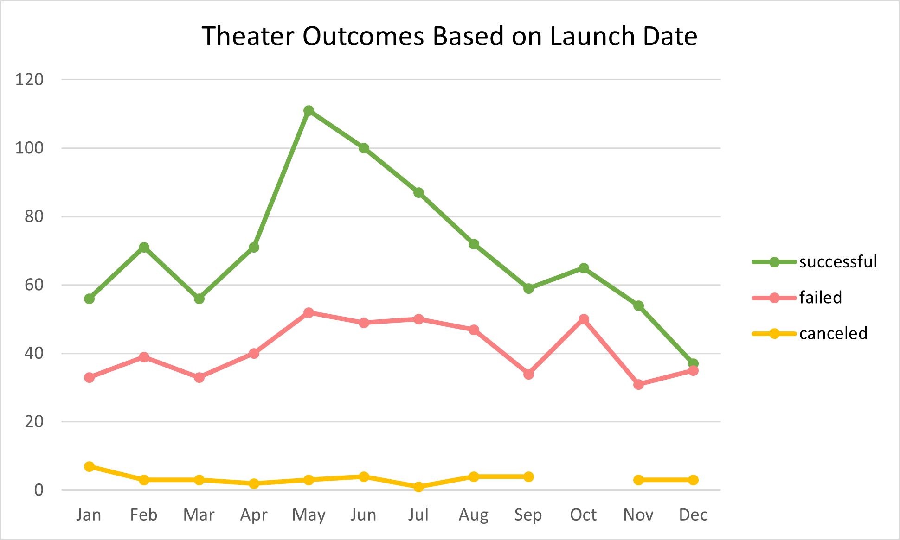

# kickstarter-challenge
Challenge 1 with Kickstarter Data  
  
# Kickstarting with Excel

## Overview of Project
Kickstarter is a popular crowdfunding internet platform. This project uses  
Excel to offer a breakdown of Kickstarter campaign data. These campaigns fall  
into 9 possible categories (Film/Video, Food, Games, Journalism, Music,  
Photography, Publishing, Technology, or Theater) and 41 subcategories.  

### Purpose
The purpose of this project is to analyze what makes a Kickstarter campaign  
a success or a failure, and to use this to make recommendations to Louise to  
create a successful campaign for her play *Fever*.  

## Analysis and Challenges

In this project 4,115 Kickstarter campaigns are compiled and organized via many  
types of accompanying data, including goal and pledged amount, project outcome,  
country, project duration, and category and subcategory.  
  
The main challenge of this project was preparing the data. Initially, the start  
and deadline dates had to be converted from Unix timestamp to human date form.  
Additionally, the Category and Subcategory data was separated so more specific  
analyses could be conducted. Percentage Funded, Average Donation, and Year  
columns were added for future comparison across projects. Filters were added  
for easy sorting and color coded cells were added to the Outcomes and  
Percentage Funded for easy visual analysis of the entire data set.  
  
Pivot tables were used to compile category and subcategory statistics. Theater  
was found to have one of the highest proportions of successful campaigns (60%),  
as well as the highest number of successess. For the subcategories, plays had  
the largest amount of successes.

### Analysis of Outcomes Based on Launch Date
To compare project outcomes with its launch date, a pivot table was created  
that filtered for the Theater category and counted the amount of successful,  
failed, or canceled projects by month. A plot was created summarizing the data.

May had the highest number of theater campaigns published, which steadily  
declines throughout the summer and reaches it minimun in December. The figure  
above shows the large spike in successful projects from April to May, as well  
as small spike in failed projects in October. The increase in the proportion of  
theater successes as well as total theater projects in May may indicate overall  
higher donation activity in that month.  

### Analysis of Outcomes Based on Goals
To compare project outcomes with stated goals, the COUNTIFS function was used  
with the tabular data to sort plays into different goal ranges. Then, the  
percentage of each outcome in each goal amout range could be calculated and  
summarized in a plot.

The figure above shows the inverse relationship between the proportion of  
successful and failed plays Kickstarters, given that no play projects had been  
canceled. For at least a 60% success rate, play goals fall into the ranges of  
under $5000, or between %35,000 and $45,000. However, 719 plays fall into the  
former range while only 9 data points are included in the ladder range.  

## Results
May, and to a lesser extent June and July, prove to be the most successful  
times of the year for campaign launches. October shows to be the least  
successful. For future *Fever* Kickstarter campaigns, Louise should prioritize  
launching in May and avoid October. Additionally, *Fever*'s current goal of  
$2885 falls within the recommended range of under $5000, so other factors of  
the future campaign should be altered.   

### Limitations
A slight limitation includes the lack of conversion of currencies to USD. While  
US-specific projects can be sorted out, conversion is useful for comparing goal   
and pledged dollar amounts across categories like all plays, or all successful   
theater projects that are independent of country, and can eliminate possible  
currency-based outliers. Additionally, the proposals above lack qualitative  
analysis (e.g., certain genres, shorter titles, or projects led by well-known  
companies may effect success). Finally, the data set only ranges from 2009-2017.  
Some of the trends in these data may be out of date, and trends in plays that   
have emerged in that last few years will be missed.

### Future Work
As stated above, *Fever* falls into the ideal goal amount ($2885) and was  
relatively highly funded (reached 86% of goal), it had only 10 backers with an  
average donation of $248.50. A plot comparing the amount of backers or average  
donation to outcome would be useful for identifying a better goal amount given  
an amount of expected backers for a project.  
Additionally, especially since the year of each project was extracted, it would 
be useful to identify historic patterns. Like the outcome vs launch date plot,  
the proportion of successes on a monthly basis could be shown over time, and  
may be a more appropriate method of revealing current launch date patterns of  
successful projects.
